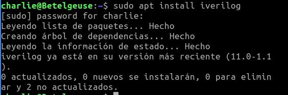
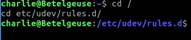
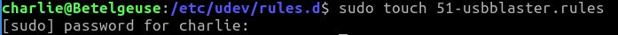
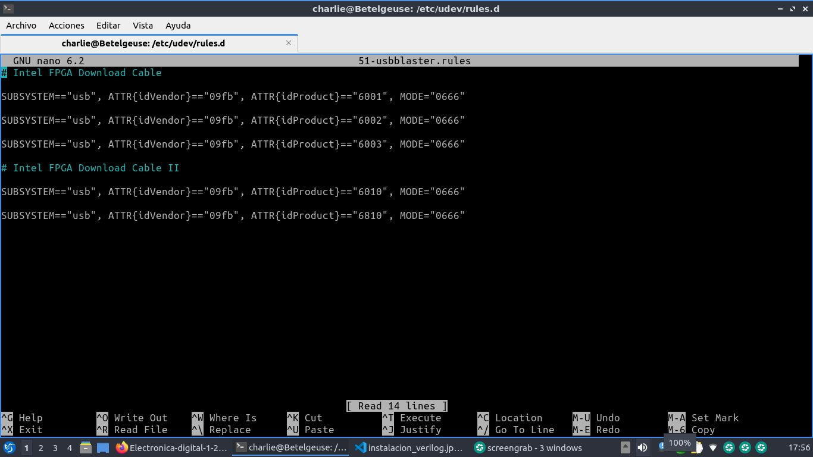

# Laboratorio 002 
## Electrónica Digital 1

### Instalación de verilog 

En primer lugar procedemos con la instalación de verilog por medio de la consola con el comando:

---
    iverilog
---

De la siguiente manera:



En esta ocasión, ya se tenía instalado este lenguaje, por ende no es necesario seguir con los pasos de su instalación.

### Configuración de *udev*

Ahora procedemos a configurar el programador de la FPGA. *udev* es un sistema de espacio de usuario que permite al administrador del sistema operativo registrar controladores de espacio de usuario para eventos. 

Para ello seguiremos una serie de pasos:

1. Creamos una regla *udev* para el programador de la FPGA, incluyendo el siguiente código en la terminal:

---
    cd /
    cd etc/udev/rules.d/
---
Resultando:



2. Creamos en el directorio, un archivo llamado **51-usbblaster.rules** mediante el siguiente código:

---
    sudo touch 51-usbblaster.rules
---

Resultando:



3. Ahora procedemos a insertar texto sugerido en la practica al archivo rules.d por medio del comando `sudo nano 51-usbblaster.rules`. 




Implementación del sumador de 1 bit
-----------------------


### Funcionamiento en la FPGA

    [Aquí](https://youtu.be/tCylA9rU-R8) se muestra un video detallado del funcionamiento del sumador

Este laboratorio se centra en la implementación de un sumador de 1 bit utilizando Verilog. A continuación, se detalla el procedimiento paso a paso.

### Archivos proporcionados


1.  `sumador1bit.v`: Este archivo contiene la descripción del módulo `sumador1bit`, que implementa la lógica de un sumador de 1 bit.

2.  `sumador1bit_tb.v`: El archivo de banco de pruebas (`sumador1bit_tb.v`) se utiliza para verificar el funcionamiento del sumador. Contiene las entradas y salidas necesarias para simular el circuito.
   
### Descripción del módulo `sumador1bit`

El módulo `sumador1bit` tiene las siguientes características:

-   Entradas:

    -   `a`: Bit de entrada A.
    -   `b`: Bit de entrada B.
    -   `cin`: Bit de acarreo de entrada.
-   Salidas:

    -   `sum`: Resultado de la suma de los bits de entrada.
    -   `cout`: Bit de acarreo de salida.

La lógica combinacional se define de la siguiente manera:

```
assign sum = (a ^ b) ^ cin;
assign cout = (a & b) | (b & cin) | (cin & a);

```

### Procedimiento de simulación

1.  Inicialización de entradas: En el archivo `sumador1bit_tb.v`, se inicializan las entradas `a`, `b` y `cin` en diferentes momentos de tiempo. Por ejemplo:

    ```
    #10 a = 1'b0; b = 1'b0; cin = 1'b0;
    #90 a = 1'b0; b = 1'b1; cin = 1'b0;
    #90 a = 1'b1; b = 1'b1; cin = 1'b0;

    ```

2.  Simulación y finalización: La simulación se ejecuta hasta que se alcanza el tiempo especificado. En este caso, se utiliza `$finish()` para finalizar la simulación:

    ```
    #90 $finish();

    ```

3.  Archivo VCD: Se genera un archivo VCD (`top.gtkw`) que contiene las formas de onda de las señales simuladas.

### Uso del archivo VCD

Para visualizar las formas de onda se usó la herramienta de simulación GTKWave, importando el archivo `top.gtkw` y verificando las señales `sum` y `cout`.

link video sumador 1bit https://youtu.be/hOxkN9kVxbQ?feature=shared
link video sumador 4bit https://youtu.be/fQqqL14Feaw?feature=shared

## Sumador de 4 bits

Ahora, Para diseñar el sumador de 4 bits, utilizamos repetidamente un sumador de 1 bit, conectándolos en serie.  entendiendo que cada sumador de 1 bit suma dos bits de los números de entrada junto con el acarreo de entrada del sumador anterior. El acarreo de salida de un sumador se conecta como el acarreo de entrada del siguiente sumador, asegurando que el acarreo se propague correctamente a través de todos los bits. de la siguiente forma. 

```verilog
module sumador4bit(
// declaracion de entradas y salidas
input [3:0] a,
input [3:0] b,
input cin,
output [3:0] s,
output cout4
);
// declaracion de cables 
wire cout1, cout2, cout3;
// instanciacion de los sumadores de 1 bit en secuencia
sumador1bit sum0 (a[0], b[0], cin,   s[0], cout1);
sumador1bit sum1 (a[1], b[1], cout1, s[1], cout2);
sumador1bit sum2 (a[2], b[2], cout2, s[2], cout3);
sumador1bit sum3 (a[3], b[3], cout3, s[3], cout4);
endmodule
```

Primero, se define el módulo principal del sumador de 4 bits (Sumador4bit.v), incluyendo las entradas para los dos números (a, b) y la señal de carry de entrada (cin), así como las salidas para el resultado (s) y el carry de salida (cout4).

```verilog
module sumador4bit(
// declaracion de entradas y salidas
input [3:0] a,
input [3:0] b,
input cin,
output [3:0] s,
output cout4
```

A continuación, se declaran los cables internos cout1, cout2 y cout3, que serán utilizados para conectar los distintos bloques sumadores de 1 bit entre sí.

Cada uno de estos bloques está enlazado a través de sus señales de carry de entrada y salida. Es crucial observar que el primer sumador de 1 bit utiliza la señal cin como su carry de entrada inicial.

```verilog
wire cout1, cout2, cout3;
// instanciacion de los sumadores de 1 bit en secuencia
sumador1bit sum0 (a[0], b[0], cin,   s[0], cout1);
sumador1bit sum1 (a[1], b[1], cout1, s[1], cout2);
sumador1bit sum2 (a[2], b[2], cout2, s[2], cout3);
sumador1bit sum3 (a[3], b[3], cout3, s[3], cout4);
endmodule
```

Finalmente, se procede a la instanciación de los sumadores de 1 bit, nombrándolos según su posición (sum0, sum1, sum2, sum3). Cada sumador se conecta de manera secuencial, asegurando que el carry de salida de un sumador sea el carry de entrada del siguiente. Este diseño asegura que los bits menos significativos se sumen primero y los carries se propaguen adecuadamente a través de los sumadores de 1 bit subsecuentes.

### Test bench 

Para lograr ver los estimulos de entrada y salida, se utiliza el testbench para las diferentes pruebas utilizando el siguiente codigo

``` timescale 1ns / 1ps
module testbench;
		// inicializamos entradas 
   reg [3:0] a, b;      
   reg cin =0;
   wire [3:0] s;       
   wire cout4;
//instanciamos modulos 
// modulo del sumador 4 bits
sumador4bit dut (
    .b(b),
    .a(a),
    .cin(cin),
    .s(s),
    .cout4(cout4)
);
 initial begin
        // Caso 1
        #100 a = 4'b0000; b = 4'b0000; cin = 1'b0;  // a = 0, b = 0, resultado = 0, Resultado_en_binario = 0000
        #101 $display("a = %b, b = %b, Suma = %b, cout = %b", a, b, s, cout4);
        // Caso 2
        #100 a = 4'b0001; b = 4'b0000; cin = 1'b0;  // a = 1, b = 0, resultado = 1, Resultado_en_binario = 0001
        #101 $display("a = %b, b = %b, Suma = %b, cout = %b", a, b, s, cout4);
        // Caso 3
        #100 a = 4'b0010; b = 4'b0011; cin = 1'b0;  // a = 2, b = 3, resultado = 5, Resultado_en_binario = 0101
        #101 $display("a = %b, b = %b, Suma = %b, cout = %b", a, b, s, cout4);
        // Caso 4
        #100 a = 4'b1111; b = 4'b0001; cin = 1'b0;  // a = 15, b = 1, resultado = 16, Resultado_en_binario = 0000, cout = 1
        #101 $display("a = %b, b = %b, Suma = %b, cout = %b", a, b, s, cout4);
        // Caso 5
        #100 a = 4'b1111; b = 4'b1111; cin = 1'b0;  // a = 15, b = 15, resultado = 30, Resultado_en_binario = 1110, cout = 1
        #101 $display("a = %b, b = %b, Suma = %b, cout = %b", a, b, s, cout4);
        // Caso 6
        #100 a = 4'b1111; b = 4'b1110; cin = 1'b0;  // a = 15, b = 14, resultado = 29, Resultado_en_binario = 1110, cout = 1
        #101 $display("a = %b, b = %b, Suma = %b, cout = %b", a, b, s, cout4);
        // Caso 7
        #100 a = 4'b0101; b = 4'b1010; cin = 1'b0;  // a = 5, b = 10, resultado = 15, Resultado_en_binario = 1111
        #101 $display("a = %b, b = %b, Suma = %b, cout = %b", a, b, s, cout4);
        // Caso 8
        #100 a = 4'b1100; b = 4'b0011; cin = 1'b0;  // a = 12, b = 3, resultado = 15, Resultado_en_binario = 0000, cout = 0
        #101 $display("a = %b, b = %b, Suma = %b, cout = %b", a, b, s, cout4);
	
	
	
	
	
	
	
    #100 $finish(); // [stop(), $finish()]
    
	end
initial
  begin
    $dumpfile("top.vcd");
    $dumpvars(0, testbench);
  end
endmodule
```

A partir de lo anterior, se puede ver que se crearon las variables de entrada (a,b) cada una de 4 bits y de igual manera las salidas son cables de 1 bit en el carry de salida y 4 bits en la salida del sumador.

En primer medida lo que hacemos es instanciar los modulos de la siguiente forma 

``` verilog
// modulo del sumador 4 bits
sumador4bit dut (
    .b(b),
    .a(a),
    .cin(cin),
    .s(s),
    .cout4(cout4)
);
```

  Posteriormente damos valores iniciales a las entradas para que los modulos produzcan salidas
```Verilog 
  initial begin
  // Initialize Inputs
    xi=0;
    for (yi = 0; yi <= 15; yi = yi + 1) begin
      if (yi==0)
        xi=xi+1;
      #5 $display("el valor de %d + %d = %d", xi,yi,zo) ;
    end
  end
  // código de parada ----
  initial begin: TEST_CASE
     $dumpfile("Sumador4bits_TB.vcd");
     $dumpvars(-1, uut);
     #(1200) $finish;
   end
  // ------      
endmodule
```
### Implementacion 

Para la implementación en la FPGA, comenzamos asignando los pines de entrada (dipswitch) y salida (diodos LED) dentro de Quartus.

Primero, abrimos Quartus y creamos un nuevo proyecto. Asignamos un nombre al proyecto y seleccionamos el modelo de FPGA que vamos a utilizar. A continuación, creamos un archivo de diseño en Verilog o VHDL, donde describimos los codigos de sumadores descritos anteriormente .

Una vez definido el comportamiento lógico, procedemos a asignar los pines de entrada y salida. Los dipswitches, que serán utilizados como entradas, se asignan a pines específicos de la FPGA. Del mismo modo, los diodos LED, que funcionarán como salidas, también se asignan a pines concretos. Este proceso se realiza en el Pin Planner de Quartus, una herramienta gráfica que facilita la asignación de pines de la FPGA.

En el Pin Planner, localizamos los pines correspondientes a los dipswitches y los asignamos a los pines de entrada de nuestro diseño. Luego, hacemos lo mismo con los diodos LED, asignándolos a los pines de salida. Es importante asegurarse de que las asignaciones de pines coincidan con el esquema de la placa FPGA que estamos utilizando para evitar conflictos y asegurar el correcto funcionamiento del diseño.

Después de asignar los pines, compilamos el proyecto en Quartus. La compilación verifica que no haya errores en el diseño y genera los archivos necesarios para programar la FPGA. procedemos a cargar el archivo de programación en la FPGA.

Con la FPGA programada, realizamos pruebas para verificar que los dipswitches controlan correctamente los diodos LED según el comportamiento lógico que hemos descrito anteriormente. lo cual se ve reflejado en las evidencias presentes en el video suministrado.

